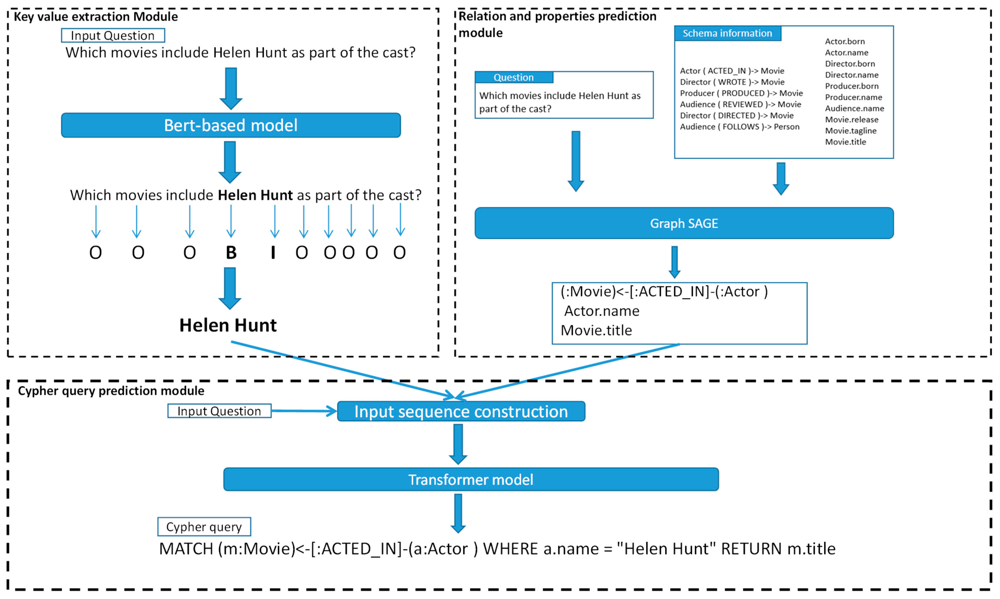

# CoBGT: Combination of BERT, GraphSAGE, and Transformer Model

## Overview
This project is an implementation of the paper "Robust Text-to-Cypher Using Combination of BERT, GraphSAGE, and Transformer (CoBGT) Model." The [original paper](https://www.mdpi.com/2076-3417/14/17/7881) proposes a novel technique to translate natural language text into cypher queries for the Neo4j graph database.
Please note that this paper was not authored by me, and the original authors did not provide a public GitHub repository for reference. The code in this repository represents my interpretation of the ideas from the paper, and as such, it may not be fully accurate or complete. It is an ongoing work. 

## Credits and Acknowledgements
Parts of this project leverages the work by :
- [Synthetic dataset created with Gemini 1.5 Pro](https://github.com/neo4j-labs/text2cypher/tree/main/datasets/synthetic_gemini_demodbs) by Tomaz Bratanic
- [Libcypher Parser](https://github.com/cleishm/libcypher-parser) by Chris Leishman, Louis-Pierre Beaumont, Jeff Lovitz and Dvir Dukhan
- [GraphSAGE](https://github.com/williamleif/GraphSAGE?tab=readme-ov-file) by William L. Hamilton and Rex Ying

For more details, you can visit the project page and the FAQ.

## Requirements
You can install all the packages using the following command
```bash
pip install -r requirements.txt
```

## Prerequisites
To run this project, you'll need to install Libcypher Parser. For more information about how to install and use the package, you can refer to my [cypher parser](https://github.com/justinsiowqi/cypher-parser) repository.

You will also need to install the spaCy English Core Model.
```bash
python -m spacy download en_core_web_lg
python -m spacy download en_core_web_trf
```

## Proposed Model
<p align="center">
 <br>
</p>

## Running the Key Value Extraction Module
To run this module, you'll need to generate a dataset containing question-cypher pairs in order to fine-tune the BERT model. Alternatively, you can attach your own dataset.

Terminal commands to run this module.
```bash
cd key_value
python generate_questions.py
python generate_cypher.py
python module.py
```

## Running the Relation Properties Module
To properly run the model with the correct data, you'll need two Neo4j graph database. The first database contains the schema and the second database contains the question-cypher groundtruth.

Terminal commands to run this module.
```bash
cd relation_properties
python create_database.py
python construct_graph.py
python module.py
```
